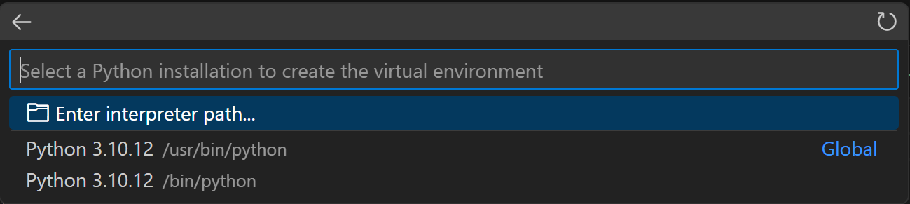
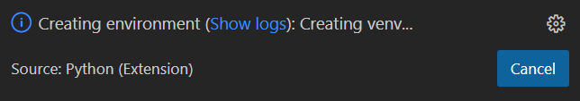
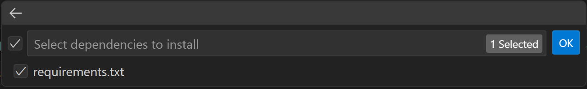

# Prepare the Environment

⚠️ **CRITICAL:** Make sure to complete all tasks below for environment preparation.

## Top Level Documents
* [Main README](README.md)

## Table of Contents
* [Quick Start (Automated Script)](#quick-start-automated-script)
* [iServer Setup](#iserver-setup)
* [Module Dependencies](#module-dependencies)
* [Install Visual Studio Code](#install-visual-studio-code)
* [Install Visual Studio Code Extensions](#install-visual-studio-code-extensions)
* [YAML Schema for auto-completion, Help, and Error Validation](#yaml-schema-for-auto-completion-help-and-error-validation)
* [Create a Virtual Environment](#create-a-virtual-environment)

## Quick Start (Automated Script)

**Step 1: Install Git**

```bash
sudo apt update && sudo apt install -y git
```

**Step 2: Clone the Repository**

```bash
git clone https://github.com/scotttyso/Cisco-AI-Pods
cd Cisco-AI-Pods
```

**Step 3: Run the Complete Setup Script**

```bash
./scripts/setup.sh
```

Optional flags:

```bash
./scripts/setup.sh --git-name "<username>" --git-email "<email>"
./scripts/setup.sh --skip-apt
./scripts/setup.sh --venv-dir ".venv-cisco"
./scripts/setup.sh --iserver-dir "/custom/iserver/path"
./scripts/setup.sh --skip-env-setup         # Skip environment prep, only download iServer
./scripts/setup.sh --skip-iserver           # Skip iServer, only prepare environment
```

What the script does:
- Auto-detects and uses apt, dnf, or yum to install Git and Python prerequisites
- Configures Git identity (if provided via flags)
- Creates and activates a Python virtual environment
- Installs Ansible tooling using centralized constraints (`constraints/python-tooling.txt`), Python dependencies (`requirements.txt`), and Ansible collections (`requirements.yaml`)
- Validates key dependencies and Ansible installation
- Downloads and extracts the latest iServer release
- Prints the remaining manual VS Code configuration and iServer setup steps

> If your distro does not use apt, dnf, or yum, install Git and Python manually, then run the script with `--skip-apt`.

#### GitHub API Rate Limiting

The setup script downloads the latest iServer release from GitHub. Unauthenticated requests have a 60 req/hour limit per IP.

If you encounter a rate limit error:
```bash
GitHub API rate limit exceeded. Export GITHUB_TOKEN with a GitHub PAT and re-run setup.sh
```

To fix it, generate a Personal Access Token and re-run:
```bash
export GITHUB_TOKEN=<your-github-pat>
./scripts/setup.sh [options]
```

How to create a GitHub Personal Access Token:
1. Go to [https://github.com/settings/tokens](https://github.com/settings/tokens)
2. Click "Generate new token" → "Generate new token (classic)"
3. Give it a name (e.g., "iserver-setup")
4. Select scope: `public_repo` (read-only access to public repositories)
5. Copy the token and use it as shown above

### [<ins>Back to Table of Contents<ins>](#table-of-contents)

## iServer Setup

The setup script (run in Step 3 above) automatically downloads the latest iServer release for OpenShift assisted installer.

iServer will be extracted into the `assisted-installer/` directory by default.

**Next Step: Review iServer Console documentation**

After setup completes, follow the iServer Console configuration guide:
[https://github.com/datacenter/iserver/blob/main/doc/ocp/Console.md](https://github.com/datacenter/iserver/blob/main/doc/ocp/Console.md)

This guide covers:
- iServer web console setup and access
- OpenShift cluster configuration
- Assisted installer workflows
- Network and storage provisioning options

> Note: The `assisted-installer/` directory is excluded from git (`.gitignore`). Each environment will need its own copy.
> You can also run the setup with `--skip-env-setup` flag to download iServer only on subsequent runs.

### [<ins>Back to Table of Contents<ins>](#table-of-contents)

## Module Dependencies

| Component | Minimum Version | Recommended | Notes |
|-----------|----------------|-------------|-------|
| Ansible Core | 2.15.0 | 2.20+ | Storage automation |
| Everpure Collection | 1.35 | Latest | Install from repository root `requirements.yaml` |
| Python | 3.12 | 3.12+ | Ansible and OpenShift dependency |
| Python Modules | N/A | Latest | Install from repository root `requirements.txt` |

### [<ins>Back to Table of Contents<ins>](#table-of-contents)

## Install Visual Studio Code

- Download Here: [*Visual Studio Code*](https://code.visualstudio.com/Download)

## Install Visual Studio Code Extensions

- Recommended Extensions: 
  - Ansible - Author Red Hat
  - GitHub Pull Requests and Issues - Author GitHub
  - Pylance - Author Microsoft
  - Python - Author Microsoft
  - YAML - Author Red Hat (Required)

- Authorize Visual Studio Code to GitHub via the GitHub Extension

### [<ins>Back to Table of Contents<ins>](#table-of-contents)

## Create a Virtual Environment

To create local environments in VS Code using virtual environments, you can follow these steps: open the Command Palette (Ctrl+Shift+P), search for the Python: Create Environment command, and select it.

> Choose one approach for virtual environment creation: terminal-based (`python3 -m venv`) or VS Code wizard. Do not create multiple virtual environments for the same workspace unless you have a specific need.


### Select an Interpreter



### Visual Studio will create the environment



### Select the Requirements File and press OK



### [<ins>Back to Table of Contents<ins>](#table-of-contents)

## YAML Schema for auto-completion, Help, and Error Validation

Add the Following to `YAML: Schemas` in Visual Studio Code: Settings > Search for `YAML: Schema`: Click edit in `settings.json`.  In the `yaml.schemas` section:

```json
"https://raw.githubusercontent.com/scotttyso/Cisco-AI-Pods/main/schema/cisco-ai-pods.json": "*.ezai.yaml"
```

### Example

```json
    "yaml.schemas": {
        "https://raw.githubusercontent.com/scotttyso/Cisco-AI-Pods/main/schema/cisco-ai-pods.json": "*.ezai.yaml"
    },
```

If needed, reactivate the virtual environment:

```bash
source .venv/bin/activate
```

### [<ins>Back to Table of Contents<ins>](#table-of-contents)
