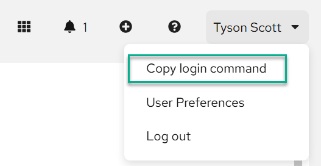
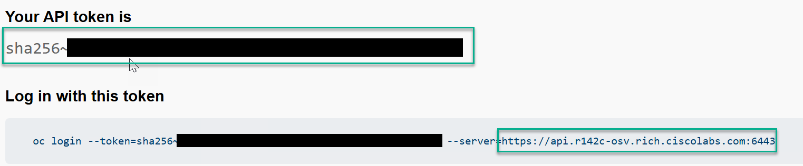

# OpenShift Deployment Order

Use this guide to run the OpenShift workflow in the correct sequence.

## Table of Contents

- [OpenShift Deployment Order](#openshift-deployment-order)
  - [Table of Contents](#table-of-contents)
  - [Quick Start](#quick-start)
  - [How to Run](#how-to-run)
  - [Variable Files](#variable-files)
  - [Run Order](#run-order)
  - [Troubleshooting](#troubleshooting)

## Quick Start

1. **Create the host_vars folder (if needed) then Copy and Edit the LDAP variables file:**

  ```bash
  mkdir host_vars/
  cp -r examples/openshift
  ```

2. **Edit each of the *.ezai.yaml files in the host_vars/openshift folder.**

3. **Export sensitive credentials as environment variables** — the playbook reads these at runtime and never writes them to disk.  Below are examples based on the example environment:

   ```bash
   export ldap_bind_password="<bind_password>"
   export openshift_api_url="https://api.<cluster>.<domain>:6443"
   export openshift_token_id="<token>"
   export redfish_password_1='replace-with-secret-1'
   export redfish_password_2='replace-with-secret-2'
   export fi_password_1='replace-with-fi-secret-1'
   export fi_password_2='replace-with-fi-secret-2'
   export ssh_public_key_1='ssh-ed25519 AAAAC3NzaC1lZDI1NTE5AAAAI... your-user@example.com'
   ```

   Obtain the token from the OpenShift web console:
   - Click your username (top-right) → **Copy login command** → **Display Token**

   
   

## How to Run

Run all Cisco AI Pods domains:

```bash
ansible-playbook playbooks/deploy_ai_pod.yaml
```

Run only the OpenShift workflow:

```bash
ansible-playbook playbooks/deploy_openshift.yaml
```

[Back to Table of Contents](#table-of-contents)

## Variable Files

- The [examples](examples) folder contains example variable files for each OpenShift module.
- Create the [host_vars](host_vars) folder if it does not exist:

  ```bash
  mkdir -p host_vars
  ```

- Copy the files you need from [examples](examples) into [host_vars](host_vars), then edit the copies with values for your environment.
- The module playbooks in the Run Order section below read their active inputs from [host_vars](host_vars).

Top-level project README:
- [Cisco-AI-Pods README](../README.md)

[Back to Table of Contents](#table-of-contents)

## Run Order

1. Install
- Generates base Assisted Installer payloads (`cluster.json`, `web_server.json`, `ssh.pub`) and, via the Python module, creates `server.json` plus `nmstate_*.yaml` profiles used for host networking and inventory mapping to be consumed with `iserver` module.
- [install README](openshift_install.md)

2. Certificates
- Applies trust bundle, ingress wildcard certificate, and API server certificate updates, then validates certificate rollout/state on the cluster.
- [certificates README](openshift_certificates.md)

3. Everpure Portworx Install
- Prepares Everpure credentials, installs Portworx Operator/StorageCluster, and creates StorageClasses for persistent workload storage.
- [Everpure Portworx README](../portworx.md)

4. OATH LDAP (Optional for Active Directory Authentication)
- Configures OpenShift OAuth/LDAP integration for AD sign-in and deploys group sync resources (including scheduled synchronization).
- [oath_ldap README](openshift_auth.md)

5. Base Operators
- Installs foundational operators needed before higher-level platform automation.
- Note: Gitea is only required if another Git service is not available.
- [Gitea README](openshift_gitea.md)
- [OpenShift GitOps Operator README](openshift_argo_cd.md)

6. OpenShift GitOps
- Generates and stages GitOps repository content (Helm/OLM trees and rendered Argo CD applications) consumed by OpenShift GitOps.
- [openshift-gitops README](openshift_gitops.md)

[Back to Table of Contents](#table-of-contents)

## Troubleshooting

- Workflow fails during install manifest generation:
  - Validate required environment variables for redfish/FI passwords are exported before running the install workflow.
  - See [install README](openshift_install.md).
- Certificate rollout is incomplete:
  - Verify certificate resources were applied and ingress/API pods were restarted as expected.
  - See [certificates README](openshift_certificates.md).
- LDAP users cannot authenticate:
  - Confirm bind credentials and LDAP sync objects are correct and sync jobs complete successfully.
  - See [oath_ldap README](openshift_auth.md).
- GitOps applications fail to sync:
  - Verify generated manifests are present in the target repository path and operator CRDs are installed first.
  - See [openshift-gitops README](openshift_gitops.md).

[Back to Table of Contents](#table-of-contents)

Back to top-level:
- [Cisco-AI-Pods README](../README.md)
